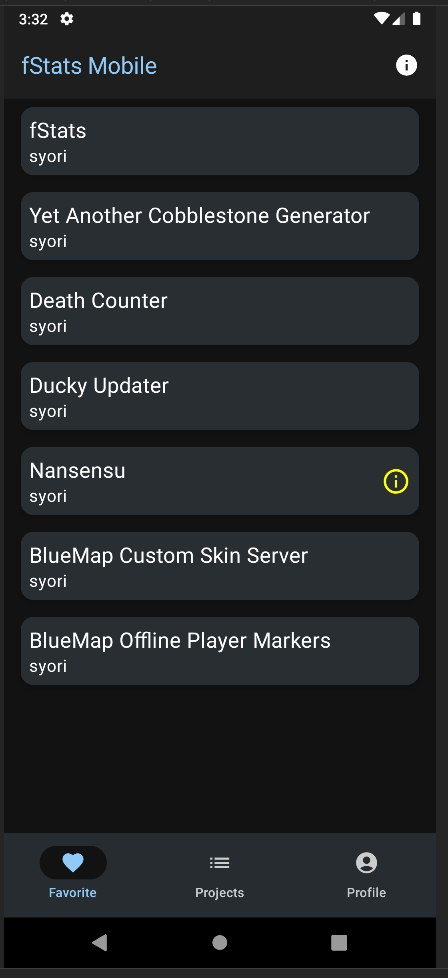
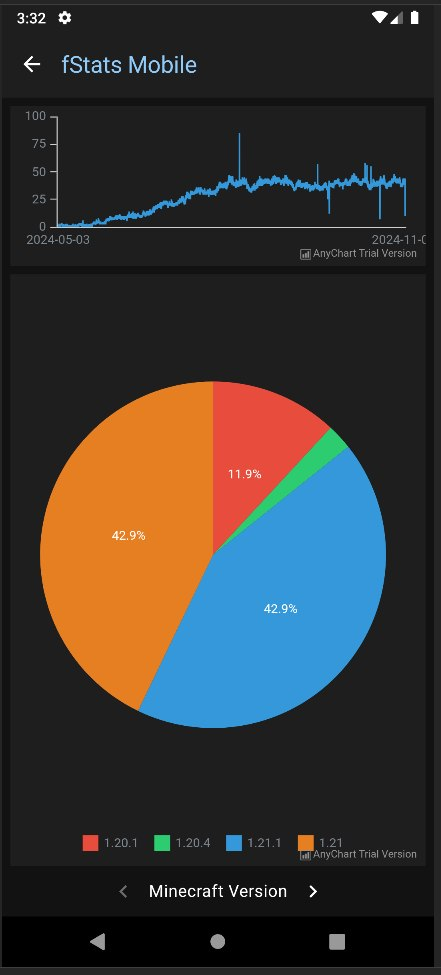

<!-- Suppress IDEA Warnings -->
<!--suppress ALL -->

> # NOTICE THAT APP DOESN'T WORK CAUSE DATABASE IS DOWN!!!

[![Contributors][contributors-shield]][contributors-url]
[![Forks][forks-shield]][forks-url]
[![Stargazers][stars-shield]][stars-url]
[![Issues][issues-shield]][issues-url]
[![MIT License][license-shield]][license-url]
[![LinkedIn][linkedin-shield]][linkedin-url]

 

<h3 align="center">fStats Mobile</h3>

  

    Metric in pocket
     
    <a href="https://github.com/fStats/fstats-mobile/issues">Support</a>
    ·
    <a href="https://github.com/fStats/fstats-mobile/issues">Report Bug</a>
    ·
    <a href="https://github.com/fStats/fstats-mobile/issues">Request Feature</a>
  

  
Table of Contents

  <ol>
    <li><a href="#about-the-project">About The Project</a></li>
    <li><a href="#contributing">Contributing</a></li>
    <li><a href="#license">License</a></li>
  </ol>

## About The Project

|  |  |
|--------------------------------|---------------------------------|

fStats Mobile is mobile application for looking and analyze data on your phone

(<a href="#readme-top">back to top</a>)

## Contributing

Contributions are what make the open source community such an amazing place to learn, inspire, and
create. Any
contributions you make are **greatly appreciated**.

If you have a suggestion that would make this better, please fork the repo and create a pull
request. You can also
simply open an issue with the tag "enhancement".
Don't forget to give the project a star! Thanks again!

1. Fork the Project
2. Create your Feature Branch (`git checkout -b feature/AmazingFeature`)
3. Commit your Changes (`git commit -m 'Add some AmazingFeature'`)
4. Push to the Branch (`git push origin feature/AmazingFeature`)
5. Open a Pull Request

(<a href="#readme-top">back to top</a>)

## License

Distributed under the MIT License. See `LICENSE.txt` for more information.

(<a href="#readme-top">back to top</a>)

[contributors-shield]: https://img.shields.io/github/contributors/fStats/fstats-mobile.svg?style=for-the-badge

[contributors-url]: https://github.com/fStats/fstats-mobile/graphs/contributors

[forks-shield]: https://img.shields.io/github/forks/fStats/fstats-mobile.svg?style=for-the-badge

[forks-url]: https://github.com/fStats/fstats-mobile/network/members

[stars-shield]: https://img.shields.io/github/stars/fStats/fstats-mobile.svg?style=for-the-badge

[stars-url]: https://github.com/fStats/fstats-mobile/stargazers

[issues-shield]: https://img.shields.io/github/issues/fStats/fstats-mobile.svg?style=for-the-badge

[issues-url]: https://github.com/fStats/fstats-mobile/issues

[license-shield]: https://img.shields.io/github/license/fStats/fstats-mobile.svg?style=for-the-badge

[license-url]: https://github.com/fStats/fstats-mobile/blob/master/LICENSE.txt

[linkedin-shield]: https://img.shields.io/badge/-LinkedIn-black.svg?style=for-the-badge&logo=linkedin&colorB=555

[linkedin-url]: https://linkedin.com/in/kit-lehto